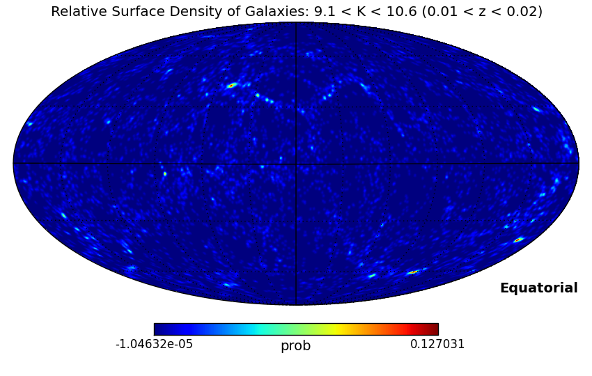
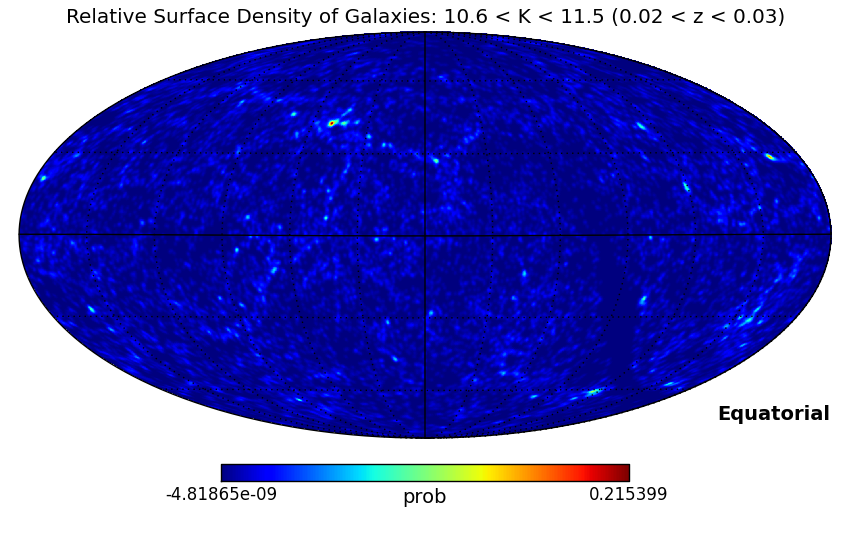
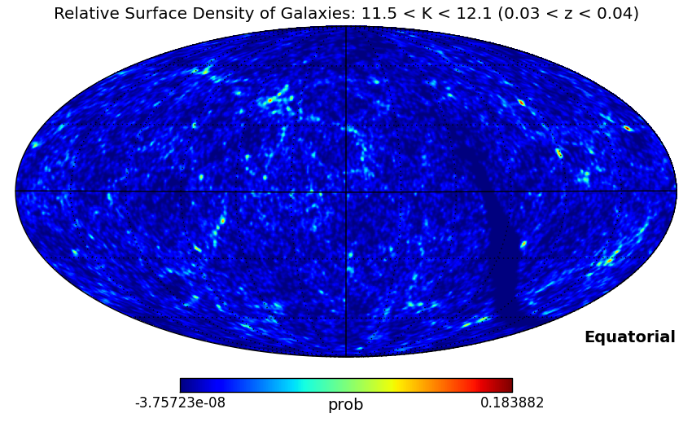

This package consists of four python scripts to work with LIGO/Virgo probability maps to generate an observing plan.

# ObsPlan

This script takes the LIGO-Virgo Skymap (P(d|m)) and optionally a
galaxy-density map (P(m)) and finds the most likely fields to
observe (P(m|d)).  The fields are assumed to be healpix regions from a
tesselation with a given value of nside (the value of nside
depends of the field of view of the telescope).

  P(position|data) = P(position) P(data|position) / P(data)

  P(position) is the galaxy density map ( P(m) )
  
  P(data|position) is the skymap from LIGO-Virgo ( P(d|m) )
  
  P(data) is constant with position so we neglect it.

1) Load the skymap

2) Load the optional galaxy density map

  a) If one map has nside greater than the other, resample the map with the larger value of nside to that of the smaller.

  b) Multiply the resulting maps together

3) Resample the probability map to the value of nside parameter (if different)

4) Sort the array by the probability 

5) Output the top N regions with healpix number, RA, Dec and probability

  or 

  Output the regions that add to a given fraction of the total probability.

  By default it would output the top ten regions, but you could set a
  parameter less than one to do the fraction of the total or greater than
  one to output N regions.

# LIGOClient

Downloads a probability map from the Grace Database and then passes it along to ObsPlan to generate an observation plan.

# GalMap

Create a galaxy density map from a catalogue in FITS format.

# Make2MASSMaps

Generates four galaxy density maps from the 2MASS Extended Source Survey

## Building a Healpix Map from a Catalog

The initial source localizations from LIGO-Virgo will cover large areas of sky and will be provided in the form a healpix map. Astrophysical sources of gravitational radiation are likely to reside in galaxies, so it would make sense to search first in regions where the LIGO-Virgo probability is large and where the density of galaxies is large as well. See [Gehrels et al. (2015)](http://arxiv.org/abs/1508.03608) for more details.

To help this process several galaxy and cluster catalogues are already linked to the LIGO-Virgo sky viewer so that observers can superimpose the galaxy catalogue visually on the LIGO-Virgo probability map. Here we implement a potentially simpler and definitely faster way to achieve a similar result. The python script below will calculate a healpix map of the galaxy density within the catalogue.

Under the Bayesian prior assumption that the probability of a gravitational-wave event from a given region of space is propoortional to the density of galaxies within volume, one can calculate an improved localization of the position of the source simply by multiplying the LIGO-Virgo skymap by the skymap produced by this script, and then look in the most probable regions.

To demonstrate this we use the 2MASS Extended Source catalogue ([Strutskie et al. 2006](http://adsabs.harvard.edu/abs/2006AJ....131.1163S)), and in the spirit of [Jarrett (2004)](http://adsabs.harvard.edu/abs/2004PASA...21..396J), we assume that all of the galaxies have the same absolute magnitude of -24 in the K-short band to obtain a loose estimate of the distance to the galaxy. The script, catalogue and maps are available on [Dropbox](https://www.dropbox.com/sh/z5edxjwfxv8wuss/AABYR-7yM-hqstGubDZvSLwJa?dl=0).

The brightest sources in the 2MASS Extended Source catalogue are concentrated in the Galactic plane and aren't likely to be galaxies at all. For this lowest redshift range a catalogue of nearby galaxies with redshifts and shapes is more appropriate, and we are currently building maps from such a catalogue. The next lowest redshift range produced by the script of 9.1 &lt; K &lt; 10.6 (0.01 &lt; z &lt; 0.02, 40 to 80 Mpc) highlights the large-scale structure nicely (a FITS map is available as well: [0.01-0.02.fits](https://www.dropbox.com/s/4fzi4g4jmtz9rqt/0.01-0.02.fits?dl=0))

The next higher redshift bin 10.6 &lt; K &lt; 11.5 (0.02 &lt; z &lt; 0.03, 80 to 120 Mpc) shows smaller scale structures but the structure from the brighter map is also obvious. This is simply because the more local large scale structure contains inherently faint as well as bright galaxies. We believe that a cut in colour as well as magnitude could allieviate this echoing, or it could be removed from spherical harmonic representation of the higher redshift density distribution. These are left for future work. The incompleteness of the catalogue in the Galactic plane is also becoming more apparent.

A best guess galaxy density distribution for the region of sky behind the Galactic plane could be obtained by masking out the Galactic plane entirely and calculating the spherical harmonic representation of the galaxy distribution including the mask and then generating a new density distribution from the spherical harmonic representation. This is left for future work as well.

The FITS file is [0.02-0.03.fits](https://www.dropbox.com/s/cet912rzzpqmpyh/0.02-0.03.fits?dl=0).

In the faintest bin considered 11.5 &lt; K &lt; 12.1 ( 0.03 &lt; z &lt; 0.04, 120 to 160 Mpc), even smaller angular-scale structures are apparent. The incompletness near the galactic centre is more pronounced as well. The FITS file is [0.03-0.04.fits](https://www.dropbox.com/s/wnjcom8tedpoa5w/0.03-0.04.fits?dl=0).

***

Elisa Antolini

Jeremy Heyl ( heyl@phas.ubc.ca )
